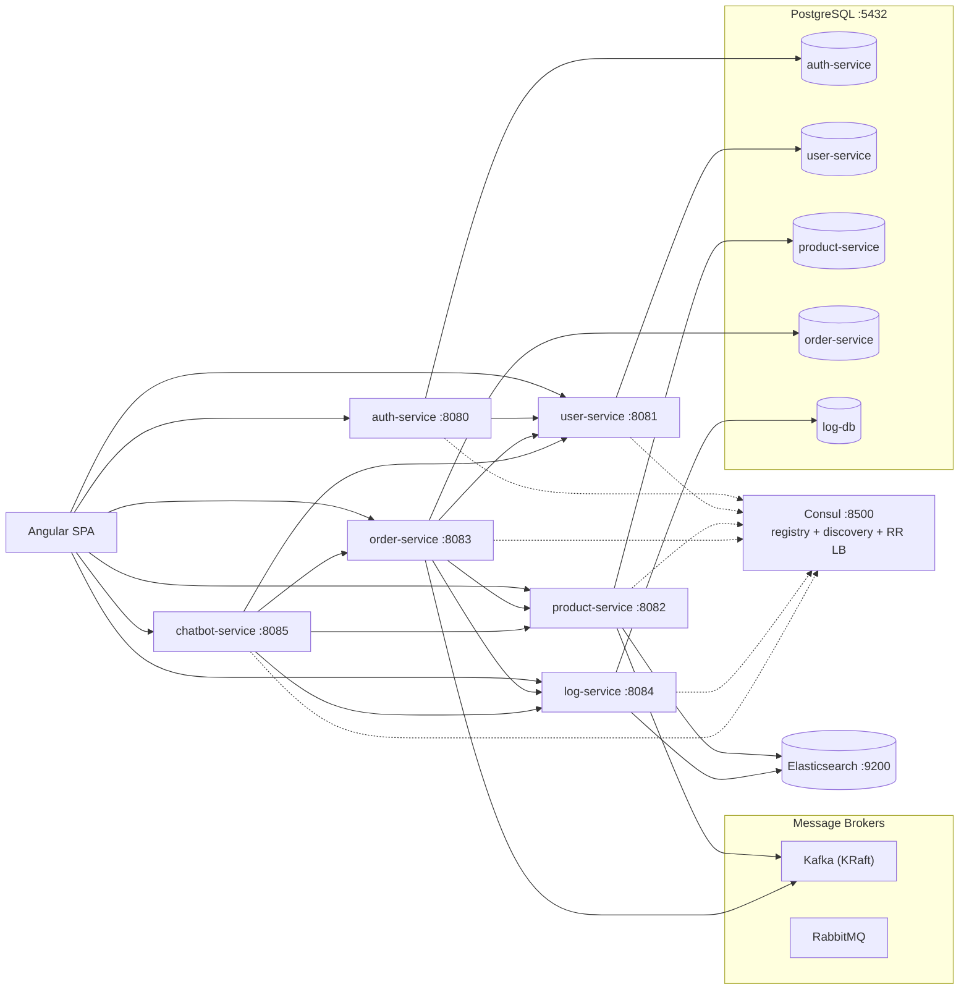

# Microservice-Tests

A Spring Boot microservice system with an Angular SPA frontend. It demonstrates service
discovery (Consul), synchronous service-to-service calls (Consul + Round-Robin load
balancing), asynchronous messaging (Kafka), JWT authentication/authorization, a
multi-stage product approval workflow, an order lifecycle with stock updates, message
logging, and a role-aware AI chatbot.

Companion flow documents live in the repository root (`architecture-flow.md`,
`product-approval-flow.md`, `chatbot-flow.md`, `oauth2-flow.md`, etc.).

---

## Architecture



- **Synchronous** service calls use a REST client resolved through **Consul** with
  **Round-Robin** load balancing (plus **Resilience4j** circuit breakers).
- **Asynchronous** messaging uses **Kafka** (broker address discovered from Consul);
  **RabbitMQ** is provisioned but currently unused by the services.
- The **chatbot-service** forwards the caller's JWT to downstream services, so backend
  role rules remain the final authority.

---

## Services

| Service | Port | Database | Highlights |
|---|---|---|---|
| **auth-service** | 8080 | PostgreSQL `auth-service` | Google OIDC login, issues HS384 JWTs, role claims, user role updates |
| **user-service** | 8081 | PostgreSQL `user-service` | Profiles, registration, activation, role administration |
| **product-service** | 8082 | PostgreSQL `product-service` + Elasticsearch | Products, 4-stage approval workflow, stock updates, notifications, search |
| **order-service** | 8083 | PostgreSQL `order-service` | Orders (v1 sync, v2/v3 Kafka async), cart, Feign/consequent stock saga, Ehcache |
| **log-service** | 8084 | PostgreSQL `log-db` + Elasticsearch | Publish/consume message logs, admin search |
| **chatbot-service** | 8085 | — | Role-scoped LLM assistant with tool calls and confirmation flow |

### Databases

- **PostgreSQL** — one logical database per service (database-per-service pattern),
  schema managed by **Flyway** (`src/main/resources/db/migration`), default user/password
  `lemon`/`lemon`.
- **Elasticsearch** — used by `product-service` and `log-service` for search.
- **Ehcache** — in-process caching in `product-service`, `order-service`, `user-service`,
  `chatbot-service`.
- **No Redis or MongoDB** in the system.

---

## Tech Stack

| Area | Technology |
|---|---|
| Language | Java 25 |
| Backend | Spring Boot 4.1.1, Spring Cloud 2025.1.2 |
| Build | Gradle (each service has its own wrapper) |
| Frontend | Angular 22 (standalone components, signals), TypeScript |
| Persistence | Spring Data JPA, Flyway, PostgreSQL |
| Search | Spring Data Elasticsearch |
| Messaging | Spring Cloud Stream + Kafka binder (`order-service`, `product-service`), Kafka (KRaft), RabbitMQ |
| Discovery | Spring Cloud Consul Discovery, Spring Cloud LoadBalancer |
| Resilience | Resilience4j CircuitBreaker, OpenFeign (`order-service`) |
| Security | Spring Security, OAuth2 Resource Server (JWT HS384), Google OIDC |
| API Docs | springdoc-openapi (Swagger UI) |
| Testing | JUnit 5, Spring Boot test starters, JaCoCo |

---

## Authentication & Roles

- `auth-service` authenticates Google logins and issues an **HS384 JWT** shared across
  services (`jwt.secret`). All services validate the token as an OAuth2 resource server
  and map the `role` claim to `ROLE_<role>` authorities. Emails listed in
  `oauth2.admin-emails` are additionally granted `ROLE_ADMIN`.
- Roles: `USER`, `MAINTAINER`, `MANAGER`, `PRODUCT_SPECIALIST`, `SALESMAN`, `ADMIN`.

### Key workflows

- **Product approval** (`product-service`): Maintainer → Manager → Product Specialist →
  Salesman → Admin. Rejections notify earlier reviewers; the Maintainer corrects and
  resubmits to the same stage. See `product-approval-flow.md`.
- **Order lifecycle** (Kafka saga): `order.created` → `order.confirmed` →
  `stock.updated` / `stock.failed`, driven by `order-service` and `product-service`.
  See `async-rabbitmq-flow.md` and `kafka-activity-flow.md`.
- **Chatbot**: role-scoped tools, read-only tools execute immediately, mutating tools
  require explicit confirmation. See `chatbot-flow.md`.

### API docs access

Swagger UI (`/swagger-ui.html`, `/swagger-ui/**`), OpenAPI (`/v3/api-docs/**`) and the
actuator endpoints are **publicly accessible** (no authentication required) so the raw UI
and spec can be opened directly in a browser. In the frontend, the "API Docs" navigation
entry and the `/services` hub page remain staff-only (ADMIN, MANAGER, MAINTAINER,
PRODUCT_SPECIALIST, SALESMAN).

---

## Getting Started

### Option A — Run the whole system with Docker (recommended)

`docker-compose.yml` defines the complete stack: PostgreSQL, Elasticsearch, Kafka,
RabbitMQ, Consul, the six Spring Boot services, and the Angular frontend.

```bash
docker compose up -d --build
```

| What | URL |
|---|---|
| Frontend (Angular SPA) | http://localhost:4200 |
| Auth service | http://localhost:8080 |
| User service | http://localhost:8081 |
| Product service | http://localhost:8082 |
| Order service | http://localhost:8083 |
| Log service | http://localhost:8084 |
| Chatbot service | http://localhost:8085 |
| Swagger UI (per service) | `http://localhost:<port>/swagger-ui.html` |
| Consul UI | http://localhost:8500 |

On first start each service runs its **Flyway** migrations, which create the schema **and**
seed the bundled application data (see “Seeded application data” below). State is kept in
named volumes (`postgres-data`, `elasticsearch-data`, `product-images`).

Stop / reset:

```bash
docker compose down       # stop, keep data
docker compose down -v    # stop and wipe all data (fresh reseed next start)
```

### Option B — Run backend services locally (Gradle)

Prerequisites: **Java 25**, **Node.js + npm**, **Docker** (for infrastructure), and a
**PostgreSQL** on `localhost:5432` (user/password `lemon`/`lemon`) with the service
databases. `docker-compose.yml` publishes its bundled Postgres on host port **5433**, so if
you use it for local runs, point the services at `localhost:5433` (see below).

1. Start infrastructure:

   ```bash
   docker compose up -d postgres elasticsearch kafka consul rabbitmq
   ```

2. Run a service (each is an independent Gradle project with its own wrapper):

   ```bash
   cd auth-service
   ./gradlew bootRun
   ```

   Repeat for `user-service`, `product-service`, `order-service`, `log-service` and
   `chatbot-service`. To use the Compose Postgres (host port `5433`):

   ```bash
   SPRING_DATASOURCE_URL=jdbc:postgresql://localhost:5433/auth-service ./gradlew bootRun
   ```

3. Run the frontend:

   ```bash
   cd frontend
   npm install
   npm start        # ng serve → http://localhost:4200
   ```

Services self-register with Consul on startup, and the frontend calls each service port
directly (see `frontend/src/app/api-config.ts`).

### Configure secrets (chatbot)

The chatbot service reads an optional, git-ignored `chatbot-service/src/main/resources/local-secrets.yaml`
for the LLM API key, or the `OPENCODE_API_KEY` environment variable. Never commit real keys.

---

## Seeded application data (Flyway)

Each service manages both its **schema** and a snapshot of the application's **data** with
Flyway migrations under `src/main/resources/db/migration`. Cloning the repository and starting
the services is therefore enough to get a fully populated, testable system — no manual SQL.

| Service | Schema migrations | Seed migration | Seeded tables |
|---|---|---|---|
| auth-service | `V1__init.sql` | `V2__seed_data.sql` | `auth_users` |
| user-service | `V1__init.sql` | `V2__seed_data.sql` | `users` |
| product-service | `V1`–`V5` | `V6__seed_data.sql` | `products`, `product_notifications`, `stock_updates` |
| order-service | `V1`–`V2` | `V3__seed_data.sql` | `orders`, `cart_items` |
| log-service | `V1__init.sql` | `V2__seed_data.sql` | `message_logs` |

Notes:

- **IDs and relationships are preserved.** Order `user_id` values reference user-service ids
  and `product_id` values reference product-service ids; approval metadata and notification
  links are kept as-is.
- **Idempotent.** Every insert uses `INSERT ... ON CONFLICT DO NOTHING`, and identity sequences
  are realigned afterwards. Migrations are safe to apply to an existing database and re-runs
  never duplicate rows.
- **Product images.** The images referenced by seeded products are bundled under
  `product-service/src/main/resources/seed-product-images/` and copied into the image storage
  directory by `SeedImageLoader` on startup, so pictures resolve on a fresh clone or volume.
  Newly uploaded images live on disk (`product.image.storage-dir`, `/app/data/product-images`
  in Docker) with their URL stored in the `products.image_url` column.
- **Regenerating the snapshot.** `scripts/generate_seed_migrations.py` regenerates the
  `V*__seed_data.sql` files from a running database.
- **Production.** These seed migrations are intended for development/testing. For production,
  remove the `V*__seed_data.sql` files and start from the schema migrations only.

### Test accounts (Google Sign-In)

Authentication is **Google Sign-In only**; there are no passwords. The seeded `auth_users` /
`users` rows are a snapshot of the original installation, so they use real Google addresses.
To test locally:

1. Sign in with **your own Google account** — the first login creates a `USER` profile.
2. To unlock staff screens, either:
   - add your email to `oauth2.admin-emails` in `auth-service` / `product-service`
     `application.yaml` (grants `ROLE_ADMIN`), or
   - update your role in `auth_users` (`UPDATE auth_users SET role='ADMIN' WHERE email='you@example.com';`)
     and `users` and sign in again.

The frontend’s account menu shows the resolved role.

---

## Testing

Each service runs its own tests and produces a JaCoCo report:

```bash
cd auth-service
./gradlew test          # also generates the per-service jacocoTestReport
```

Aggregate coverage across all services:

```bash
./jacoco-aggregate.sh
```

The aggregated HTML report is written to
`build/reports/jacoco/aggregate/html/index.html`.

---

## Project Structure

```
.
├── auth-service/         # Google login, JWT issuance
├── user-service/         # Profiles & role administration
├── product-service/      # Catalog, approval workflow, search
├── order-service/        # Orders, cart, Kafka saga
├── log-service/          # Publish/consume message logs
├── chatbot-service/      # Role-scoped AI assistant
├── frontend/             # Angular SPA
├── consul/               # Consul agent config
├── docker/               # Dockerfiles + Postgres init (databases)
├── scripts/              # Seed migration generator, image fetch helper
├── docker-compose.yml    # Full stack: infra + all services + frontend
├── build.gradle          # Root JaCoCo aggregation
├── jacoco-aggregate.sh   # Run all tests + aggregate coverage
└── *.md                  # Architecture / flow documentation
```

---

## Documentation Index

| Document | Description |
|---|---|
| `application-description.md` | What the application does: capabilities, roles, pages and their features |
| `architecture-flow.md` | System architecture and core activity flows |
| `authentication-flow.md` | Authentication overview |
| `auth-service-flow.md` | Auth service internals |
| `oauth2-flow.md` | OAuth2 / Google login |
| `service-authentication-flow.md` | Service-to-service auth |
| `product-approval-flow.md` | Product approval workflow |
| `kafka-activity-flow.md` | Kafka messaging activity |
| `async-rabbitmq-flow.md` | Asynchronous messaging flow |
| `circuit-breaker-flow.md` | Resilience4j circuit breakers |
| `consul-flow.md` | Service discovery |
| `chatbot-flow.md` | Chatbot tool-calling flow |
