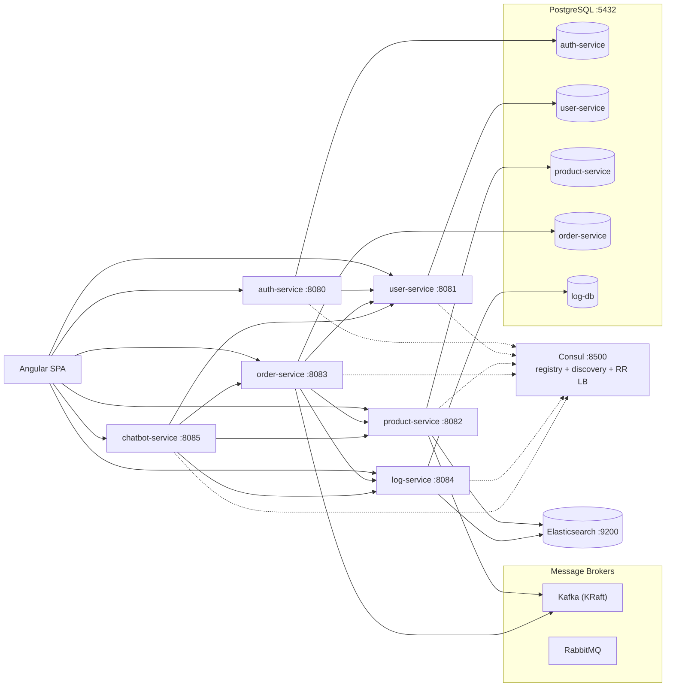

# Microservice-Tests

A Spring Boot microservice system with an Angular SPA frontend. It demonstrates service
discovery (Consul), synchronous service-to-service calls (Consul + Round-Robin load
balancing), asynchronous messaging (Kafka), JWT authentication/authorization, a
multi-stage product approval workflow, an order lifecycle with stock updates, message
logging, and a role-aware AI chatbot.

Companion flow documents live in the repository root (`architecture-flow.md`,
`product-approval-flow.md`, `chatbot-flow.md`, `oauth2-flow.md`, etc.).

---

## Architecture



- **Synchronous** service calls use a REST client resolved through **Consul** with
  **Round-Robin** load balancing (plus **Resilience4j** circuit breakers).
- **Asynchronous** messaging uses **Kafka** (broker address discovered from Consul);
  **RabbitMQ** is provisioned but currently unused by the services.
- The **chatbot-service** forwards the caller's JWT to downstream services, so backend
  role rules remain the final authority.

---

## Services

| Service | Port | Database | Highlights |
|---|---|---|---|
| **auth-service** | 8080 | PostgreSQL `auth-service` | Google OIDC login, issues HS384 JWTs, role claims, user role updates |
| **user-service** | 8081 | PostgreSQL `user-service` | Profiles, registration, activation, role administration |
| **product-service** | 8082 | PostgreSQL `product-service` + Elasticsearch | Products, 4-stage approval workflow, stock updates, notifications, search |
| **order-service** | 8083 | PostgreSQL `order-service` | Orders (v1 sync, v2/v3 Kafka async), cart, Feign/consequent stock saga, Ehcache |
| **log-service** | 8084 | PostgreSQL `log-db` + Elasticsearch | Publish/consume message logs, admin search |
| **chatbot-service** | 8085 | — | Role-scoped LLM assistant with tool calls and confirmation flow |

### Databases

- **PostgreSQL** — one logical database per service (database-per-service pattern),
  schema managed by **Flyway** (`src/main/resources/db/migration`), default user/password
  `lemon`/`lemon`.
- **Elasticsearch** — used by `product-service` and `log-service` for search.
- **Ehcache** — in-process caching in `product-service`, `order-service`, `user-service`,
  `chatbot-service`.
- **No Redis or MongoDB** in the system.

---

## Tech Stack

| Area | Technology |
|---|---|
| Language | Java 25 |
| Backend | Spring Boot 4.1.1, Spring Cloud 2025.1.2 |
| Build | Gradle (each service has its own wrapper) |
| Frontend | Angular 22 (standalone components, signals), TypeScript |
| Persistence | Spring Data JPA, Flyway, PostgreSQL |
| Search | Spring Data Elasticsearch |
| Messaging | Spring Cloud Stream + Kafka binder (`order-service`, `product-service`), Kafka (KRaft), RabbitMQ |
| Discovery | Spring Cloud Consul Discovery, Spring Cloud LoadBalancer |
| Resilience | Resilience4j CircuitBreaker, OpenFeign (`order-service`) |
| Security | Spring Security, OAuth2 Resource Server (JWT HS384), Google OIDC |
| API Docs | springdoc-openapi (Swagger UI) |
| Testing | JUnit 5, Spring Boot test starters, JaCoCo |

---

## Authentication & Roles

- `auth-service` authenticates Google logins and issues an **HS384 JWT** shared across
  services (`jwt.secret`). All services validate the token as an OAuth2 resource server
  and map the `role` claim to `ROLE_<role>` authorities. Emails listed in
  `oauth2.admin-emails` are additionally granted `ROLE_ADMIN`.
- Roles: `USER`, `MAINTAINER`, `MANAGER`, `PRODUCT_SPECIALIST`, `SALESMAN`, `ADMIN`.

### Key workflows

- **Product approval** (`product-service`): Maintainer → Manager → Product Specialist →
  Salesman → Admin. Rejections notify earlier reviewers; the Maintainer corrects and
  resubmits to the same stage. See `product-approval-flow.md`.
- **Order lifecycle** (Kafka saga): `order.created` → `order.confirmed` →
  `stock.updated` / `stock.failed`, driven by `order-service` and `product-service`.
  See `async-rabbitmq-flow.md` and `kafka-activity-flow.md`.
- **Chatbot**: role-scoped tools, read-only tools execute immediately, mutating tools
  require explicit confirmation. See `chatbot-flow.md`.

### API docs access

Swagger UI (`/swagger-ui.html`, `/swagger-ui/**`), OpenAPI (`/v3/api-docs/**`) and the
actuator endpoints are **publicly accessible** (no authentication required) so the raw UI
and spec can be opened directly in a browser. In the frontend, the "API Docs" navigation
entry and the `/services` hub page remain staff-only (ADMIN, MANAGER, MAINTAINER,
PRODUCT_SPECIALIST, SALESMAN).

---

## Getting Started

### Prerequisites

- Java 25
- Node.js + npm (for the frontend)
- Docker (for the provided infrastructure containers)
- A running **PostgreSQL** (`:5432`, user `lemon`/`lemon`) with the service databases
- A running **Elasticsearch** (`:9200`) — required by `product-service` and `log-service`

> `docker-compose.yml` provisions only **Kafka**, **RabbitMQ**, and **Consul**.
> PostgreSQL and Elasticsearch must be provided separately.

### 1. Start infrastructure

```bash
docker compose up -d
```

This starts Kafka (`:9092`), RabbitMQ (`:5672`, management UI `:15672`), and
Consul (`:8500`).

### 2. Configure secrets (chatbot)

The chatbot service loads an optional, git-ignored `local-secrets.yaml` for the LLM API
key (`chatbot-service/src/main/resources/local-secrets.yaml`) or reads `OPENCODE_API_KEY`
from the environment. Do not commit real keys.

### 3. Run a backend service

Each service is an independent Gradle project with its own wrapper:

```bash
cd auth-service
./gradlew bootRun
```

Repeat for `user-service`, `product-service`, `order-service`, `log-service`, and
`chatbot-service`. Services self-register with Consul when they start.

### 4. Run the frontend

```bash
cd frontend
npm install
npm start        # ng serve
```

The SPA talks directly to the service ports (see `frontend/src/app/api-config.ts`).

---

## Demo Environment & Automatic Test Data

A fresh installation can be pre-populated with safe, representative test data so that
products, orders, users and roles are available **immediately after startup** — no manual
SQL is required.

### How database initialization works

1. **Schema** is managed by **Flyway** versioned migrations in each service
   (`src/main/resources/db/migration/*.sql`). They always run.
2. **Test/demo data** lives in a separate location: `src/main/resources/db/demo/*.sql`
   (auth, user, product, order services). Flyway only scans this location when the
   **`demo` Spring profile** is active (`application-demo.yaml` sets
   `spring.flyway.locations: classpath:db/migration,classpath:db/demo`).

Demo data is **never** inserted into production: the default profile and production
deployments only use `db/migration`. Seeding is idempotent — Flyway records each migration
once, and the SQL uses `ON CONFLICT ... DO NOTHING` as a second safeguard, so restarts and
repeated startup never duplicate records.

### Enabling demo data on a fresh install

Start the services with the `demo` profile active. With the provided Compose stack:

```bash
SPRING_PROFILES_ACTIVE=demo docker compose up -d
```

or set `SPRING_PROFILES_ACTIVE=demo` in your environment / `.env` for the compose project.
Running without the `demo` profile (or with `prod`) produces an empty database (schema only).

### Test accounts (Google Sign-In)

Authentication is **Google Sign-In only**. These demo emails are pre-registered with the
correct role and `active = true` in both `auth-service` (`auth_users`) and `user-service`
(`users`):

| Role | Email | Note |
|---|---|---|
| Admin | `admin@example.com` | Full administration |
| Maintainer | `maintainer@example.com` | Creates / resubmits products |
| Manager | `manager@example.com` | Manager-stage approval |
| Product Specialist | `specialist@example.com` | Specialist-stage approval |
| Salesman | `salesman@example.com` | Salesman-stage approval |
| User | `user@example.com` | Storefront / cart / orders |

**Limitation:** Google only lets you sign in with an account you control, so to exercise a
specific role you need a Google account whose email matches the row above. For quick local
testing, log in once with any Google account (grabbing the `USER` role by default). To try
the staff pages, either sign in with a matching email, or use Consul/API tooling to change a
user's role. The frontend's login page shows the resolved role on the account menu.

### What demo data is seeded

- **auth-service** — six role accounts (`auth_users`).
- **user-service** — the same six accounts with `active = true`, ids `1..6`.
- **product-service** — ten approved products covering every category (including a
  low-stock and an out-of-stock item for the stock sorter) plus two sample notifications.
- **order-service** — four sample orders (CONFIRMED / PENDING / REJECTED) and two cart items,
  referencing the seeded demo user and product ids (`1..6` / `1..10`).
- No fake message logs are seeded — the audit log always reflects real runtime activity.

### Creating a clean demo environment safely

1. Stop the services.
2. Remove the service databases (or the Postgres volume for a fully clean run).
3. Start with `SPRING_PROFILES_ACTIVE=demo docker compose up -d`.
4. Flyway recreates the schema and the demo data is applied once.

For a locally run backend (Gradle), start each service with:

```bash
./gradlew bootRun --args='--spring.profiles.active=demo'
```

### Troubleshooting

- **Flyway migration failure on startup**: the output shows which migration and file failed.
  Because migrations are versioned, fix forward by adding a new migration instead of editing
  an applied one.
- **Demo data not appearing**: confirm the service logs show `Migrating schema ... to version
  900` and that `SPRING_PROFILES_ACTIVE=demo` was set before the first startup.
- **Duplicate-key errors**: the demo inserts use `ON CONFLICT ... DO NOTHING`; if you still
  see a conflict a previously applied version exists — inspect `flyway_schema_history` in the
  service database.
- **Before production**: remove the `demo` profile, verify `flyway.locations` is only
  `classpath:db/migration` (the default), and rotate database credentials / secrets.

---

## Testing

Each service runs its own tests and produces a JaCoCo report:

```bash
cd auth-service
./gradlew test          # also generates the per-service jacocoTestReport
```

Aggregate coverage across all services:

```bash
./jacoco-aggregate.sh
```

The aggregated HTML report is written to
`build/reports/jacoco/aggregate/html/index.html`.

---

## Project Structure

```
.
├── auth-service/         # Google login, JWT issuance
├── user-service/         # Profiles & role administration
├── product-service/      # Catalog, approval workflow, search
├── order-service/        # Orders, cart, Kafka saga
├── log-service/          # Publish/consume message logs
├── chatbot-service/      # Role-scoped AI assistant
├── frontend/             # Angular SPA
├── consul/               # Consul agent config
├── docker-compose.yml    # Kafka, RabbitMQ, Consul
├── build.gradle          # Root JaCoCo aggregation
├── jacoco-aggregate.sh   # Run all tests + aggregate coverage
└── *.md                  # Architecture / flow documentation
```

---

## Documentation Index

| Document | Description |
|---|---|
| `application-description.md` | What the application does: capabilities, roles, pages and their features |
| `architecture-flow.md` | System architecture and core activity flows |
| `authentication-flow.md` | Authentication overview |
| `auth-service-flow.md` | Auth service internals |
| `oauth2-flow.md` | OAuth2 / Google login |
| `service-authentication-flow.md` | Service-to-service auth |
| `product-approval-flow.md` | Product approval workflow |
| `kafka-activity-flow.md` | Kafka messaging activity |
| `async-rabbitmq-flow.md` | Asynchronous messaging flow |
| `circuit-breaker-flow.md` | Resilience4j circuit breakers |
| `consul-flow.md` | Service discovery |
| `chatbot-flow.md` | Chatbot tool-calling flow |
