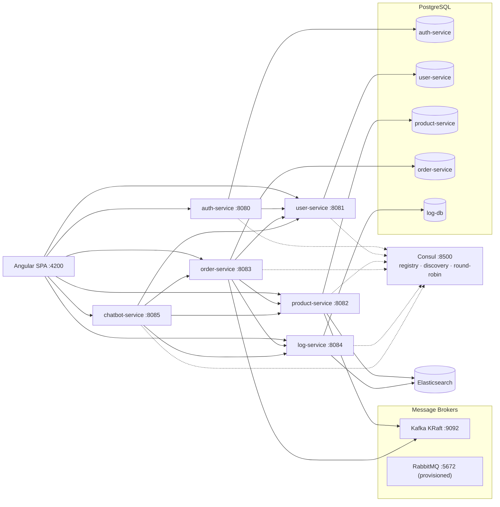

# Application Description

> **Microservice-Tests** is a reference e-commerce back-office and storefront built as a
> Spring Boot microservice system with an Angular single-page frontend. It demonstrates the
> full lifecycle of a modern distributed application: service discovery, synchronous and
> asynchronous communication, JWT security, a multi-stage approval workflow, an event-driven
> order saga, centralized message logging, full-text search, and a role-aware AI assistant.

---

## 1. What the application does

In one sentence: it lets an organization manage a product catalog through a governed
approval process, let customers browse products and place orders, fulfill those orders
through an event-driven stock saga, audit every inter-service message, and let staff drive
all of it from either a web UI or an AI chatbot.

The main capabilities are:

| Capability | Description |
|---|---|
| **Authentication & authorization** | Google sign-in (or seeded admin login). The auth-service issues one HS384 JWT that every service validates and maps to role-based access rules. |
| **User management** | Customer/staff profiles with activation/deactivation, registration and role administration (USER, MAINTAINER, MANAGER, PRODUCT_SPECIALIST, SALESMAN, ADMIN). |
| **Product catalog** | Product CRUD with categories, price and stock management, plus a five-stage review workflow before a product becomes sellable. |
| **Multi-stage approval workflow** | Maintainer → Manager → Product Specialist → Salesman → Admin, with rejection reasons and resubmission to the rejecting stage. |
| **Product search** | Full-text product search backed by Elasticsearch, exposed through the frontend search bar and the API. |
| **Order lifecycle** | Orders in three interchangeable API styles: v1 synchronous REST, v2 asynchronous Kafka saga, and v3 asynchronous via OpenFeign. |
| **Shopping cart & checkout** | Browser cart with add/update/remove/clear and cart checkout that turns into an order. |
| **Stock fulfillment saga** | Event-driven stock reservation with idempotent de-duplication, row locking, and explicit success/failure compensation events. |
| **Notifications** | Reviewers and prior approvers are notified of approvals, rejections, and final outcomes. |
| **Message logging & audit** | Every Kafka publish/consume is recorded in the log-service and is searchable by admins. |
| **AI chatbot** | A role-scoped LLM assistant that can read and (with confirmation) mutate data by calling the real services with the caller's JWT. |
| **Service discovery & resilience** | Consul registry with round-robin load balancing, Resilience4j circuit breakers, and 5-second time limiters on synchronous calls. |
| **API documentation** | Every service exposes OpenAPI/Swagger UI and Spring Actuator health/operability endpoints. |

---

## 2. Who can do what (role-based capabilities)

Roles are carried as a `role` claim in the JWT; each service re-checks them independently.

| Role | Capabilities |
|---|---|
| **USER** (customer) | Browse and search products, add to cart, place and cancel own orders, view own order history, use the chatbot for shopping actions. |
| **MAINTAINER** | Create products, edit and resubmit rejected products, view product list, view/confirm orders, receive notifications. |
| **MANAGER** | Review products at the Manager stage, view products and pending approvals, view/confirm orders, notifications. |
| **PRODUCT_SPECIALIST** | Review products at the Product Specialist stage, view products and pending approvals, notifications. |
| **SALESMAN** | Review products at the Salesman stage, view products and pending approvals, notifications. |
| **ADMIN** | Final product approval, full product stock/price/name administration, user creation and role management, create/confirm any order, view all logs, use all chatbot tools. |

Emails listed in `oauth2.admin-emails` are additionally granted `ROLE_ADMIN`.

---

## 3. Core workflows

### 3.1 Sign-in and token flow

1. The Angular SPA renders a Google Sign-In button.
2. Google returns a signed ID token to the browser.
3. The SPA posts the ID token to `auth-service` (`POST /auth/google`).
4. `auth-service` verifies it against Google's JWKS (issuer + audience), resolves/creates
   the local user, checks that the profile is active, and issues the application's HS384 JWT.
5. Every subsequent request carries that JWT; each service verifies the signature and expiry
   and enforces its own role rules. A seeded `admin@example.com / admin123` account exists
   for local use.

### 3.2 Product approval

A product passes through every stage in order:

```
Maintainer creates → Manager → Product Specialist → Salesman → Admin → APPROVED
```

Any rejection records a reason and notifies all earlier reviewers; the Maintainer edits the
product and resubmits it to the exact stage that rejected it.

### 3.3 Order lifecycle (async Kafka saga)

```
order.created → order.confirmed → stock.updated   (success → CONFIRMED)
                                 ↘ stock.failed    (failure → REJECTED)
```

- `order-service` publishes `order.created` for a new order and `order.confirmed` when an
  admin confirms it.
- `product-service` consumes `order.confirmed`, reserves stock under a row lock, de-duplicates
  by `orderId`, and publishes `stock.updated` or `stock.failed` after commit.
- `order-service` consumes the outcome and sets the order to `CONFIRMED` or `REJECTED`.

The same business operation is available synchronously (v1) and through Feign (v3), so the
three API styles can be compared side by side.

### 3.4 AI chatbot

The chatbot (`chatbot-service`) is scoped to the caller's role. Read-only tools execute
immediately; mutating tools are proposed first and only run after the user confirms. The
caller's JWT is forwarded to downstream services, so the backend security rules remain the
final authority.

---

## 4. System architecture



- **Synchronous** service-to-service calls resolve instances through Consul and use a
  round-robin load balancer, wrapped in Resilience4j circuit breakers.
- **Asynchronous** messaging uses Kafka; the broker address is itself discovered from Consul.
- Each service owns its own database (database-per-service), with schema managed by Flyway.

---

## 5. Services

| Service | Port | Storage | Responsibility |
|---|---|---|---|
| **auth-service** | 8080 | PostgreSQL `auth-service` | Google OIDC login, JWT issuance, role claims |
| **user-service** | 8081 | PostgreSQL `user-service` | Profiles, registration, activation, role administration |
| **product-service** | 8082 | PostgreSQL + Elasticsearch | Products, approval workflow, stock updates, notifications, search |
| **order-service** | 8083 | PostgreSQL | Orders (v1/v2/v3), cart, stock saga, circuit breakers, Ehcache |
| **log-service** | 8084 | PostgreSQL + Elasticsearch | Publish/consume message logs, admin search |
| **chatbot-service** | 8085 | — | Role-scoped AI assistant with tool calls and confirmation |
| **frontend** | 4200 | — | Angular SPA |

Supporting infrastructure: **Consul** (registry), **Kafka**, **RabbitMQ** (provisioned, currently
unused by the services), **PostgreSQL**, **Elasticsearch**.

---

## 6. Pages and features

The Angular SPA (single-page app, routes change the view without a full reload) exposes the
following pages. Each page is guarded by the roles listed.

| # | Page | Route | Who can open it | Features on the page |
|---|------|-------|-----------------|----------------------|
| 1 | **Login** | `/login` | everyone (public) | Google Sign-In button, error/success message, redirect to the role's home page after sign-in |
| 2 | **Product Dashboard** | `/dashboard` | USER | Product table (ID, name, price, available quantity); per-row quantity input; **Add to Cart**; **Order Now** (with confirm); **Refresh**; search results via the `?q=` query parameter; feedback message |
| 3 | **Cart** | `/cart` | USER | Cart table (select, product, price, quantity, subtotal); **select all** / per-item selection; edit quantity (capped at available stock); **Remove**; selected total; **Checkout Selected** |
| 4 | **My Orders** | `/my-orders` | USER | Own-orders table (ID, product, quantity, status, product updated); **Refresh**; **Cancel** when the status allows it; search filter via `?q=` |
| 5 | **Add Product** | `/product/add` | MAINTAINER | Create-product form (name, price, available quantity, category); **Submit to Manager** |
| 6 | **Product List** | `/product/list` | MAINTAINER, MANAGER, PRODUCT_SPECIALIST, SALESMAN, ADMIN | **Create Product form at the top** (MAINTAINER only); sort (default / out of stock / low stock); **Refresh**; product table (ID, name, price, available, category, status, rejection reason, action); inline **Edit** + **Resubmit** for rejected products created by the signed-in maintainer |
| 7 | **Pending Approvals** | `/product/pending` | MANAGER, PRODUCT_SPECIALIST, SALESMAN, ADMIN | **Refresh**; table with maintainer/reviewer columns, status and a rejection-reason input; **Approve** / **Reject** |
| 8 | **All Products (Stock)** | `/product/stock` | ADMIN | **Refresh**; sort; table with **Add Stock**, **Update Price** and **Update Name** per product |
| 9 | **Create Order** | `/order/create` | ADMIN | API-version selector (v1 sync / v2 Kafka async / v3 Feign); create-order form (user ID, product ID, quantity) |
| 10 | **All Orders** | `/order/list` | ADMIN, MANAGER, MAINTAINER | API-version selector; **Create Order form at the top** (ADMIN only); **Refresh** (auto-refreshes every 5s); orders table (ID, user name, user email, user ID, product ID, quantity, status, product updated, action); **Confirm** for `PENDING` orders; search filter via `?q=` |
| 11 | **Create User** | `/user/create` | ADMIN | Create-user form (name, email) |
| 12 | **All Users** | `/user/list` | ADMIN | **Create User form at the top**; **Refresh**; users table (ID, name, email, active status, role, change-role dropdown + **Set Role**, **Activate**/**Deactivate**); search filter via `?q=` |
| 13 | **Notifications** | `/notifications` | MAINTAINER, MANAGER, PRODUCT_SPECIALIST, SALESMAN, ADMIN | **Refresh**; **Mark all read**; notifications table (ID, product, message, read/unread, **Mark read**) |
| 14 | **Message Logs** | `/log` | ADMIN | **Refresh**; **Clear All Logs**; filters by service, direction (published/consumed) and status (success/failed); logs table (ID, time, service, direction, routing key, status, email, detail, JSON payload) |
| 15 | **Services / API Docs hub** | `/services` | ADMIN, MANAGER, MAINTAINER, PRODUCT_SPECIALIST, SALESMAN | One card per service with a live health badge (**UP**/**DOWN**) and links to **Swagger UI**, **OpenAPI** and **Health**; **Refresh status** |
| 16 | **Chatbot** (global widget) | overlay on every authenticated page | all signed-in roles | Open/close launcher; shows the current role; conversation history; free-text prompt; **confirmation prompt** for mutating actions with **Yes, confirm** / **Cancel** |

### Cross-cutting UI

These appear on (or around) the pages above:

- **Navbar** — role-based navigation links, plus an **API Docs** entry for staff.
- **Global search** — context-aware search box with live suggestions; the context and target
  page follow the current section (products, users, orders or logs).
- **Account menu** — shows the signed-in user's name, email and role, with **Logout**.
- **Confirmation dialog** — every important create/update/approve/reject/cancel action asks
  for confirmation before it runs.
- **Route guards** — `authGuard` (signed-in), `roleGuard(...)` (specific roles), `adminGuard`
  (ADMIN) and `dashboardGuard` (USER dashboard) protect the pages above.

### Typical journey by role

| Role | Usual pages |
|---|---|
| **USER** | Dashboard → Cart → My Orders |
| **MAINTAINER** | Product List (create/edit/resubmit) → Notifications → Orders |
| **MANAGER** | Pending Approvals → Product List → Orders → Notifications |
| **PRODUCT_SPECIALIST** | Pending Approvals → Product List → Notifications |
| **SALESMAN** | Pending Approvals → Product List → Notifications |
| **ADMIN** | Pending Approvals → All Products → Orders → Users → Logs → Notifications → Services |

---

## 7. Technology stack

| Area | Technology |
|---|---|
| Language | Java 25 |
| Backend | Spring Boot 4.1.1, Spring Cloud 2025.1.2 |
| Build | Gradle (per-service wrappers) |
| Frontend | Angular 22 (standalone components, signals), TypeScript |
| Persistence | Spring Data JPA, Flyway, PostgreSQL |
| Search | Spring Data Elasticsearch |
| Messaging | Spring Cloud Stream + Kafka binder; Kafka (KRaft) |
| Discovery | Spring Cloud Consul Discovery, Spring Cloud LoadBalancer |
| Resilience | Resilience4j CircuitBreaker, OpenFeign |
| Security | Spring Security, OAuth2 Resource Server (HS384 JWT), Google OIDC |
| API docs | springdoc-openapi / Swagger UI, Spring Actuator |
| Testing | JUnit 5, Spring Boot test starters, JaCoCo |

---

## 8. Getting around

- **Frontend:** http://localhost:4200
- **Service health / Swagger UI:** `http://localhost:<port>/actuator/health` and
  `/swagger-ui.html` for each service.
- **Consul UI:** http://localhost:8500
- **RabbitMQ management:** http://localhost:15672

For architecture and per-flow diagrams, see `architecture-flow.md`,
`product-approval-flow.md`, `kafka-activity-flow.md`, `oauth2-flow.md`,
`service-authentication-flow.md`, `consul-flow.md`, `circuit-breaker-flow.md`, and
`chatbot-flow.md`.
