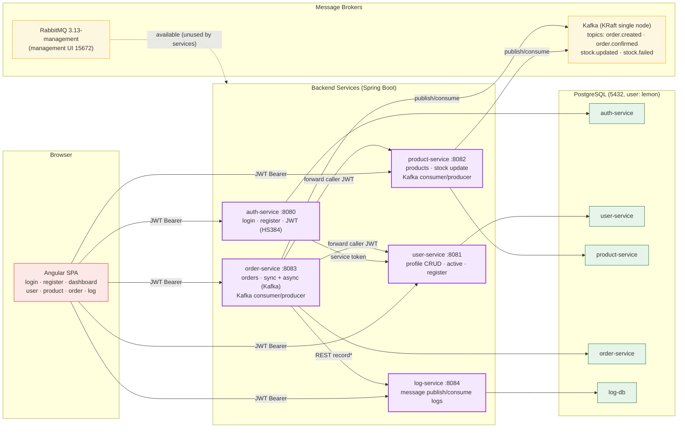
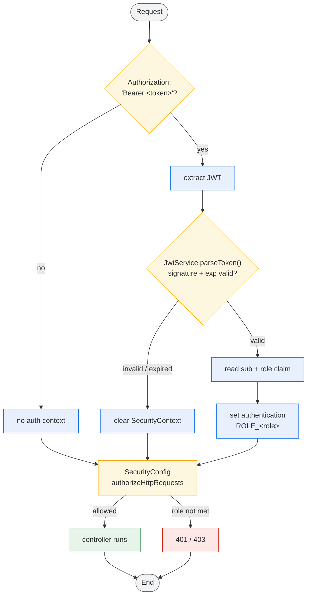
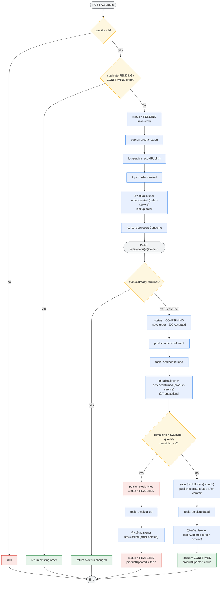
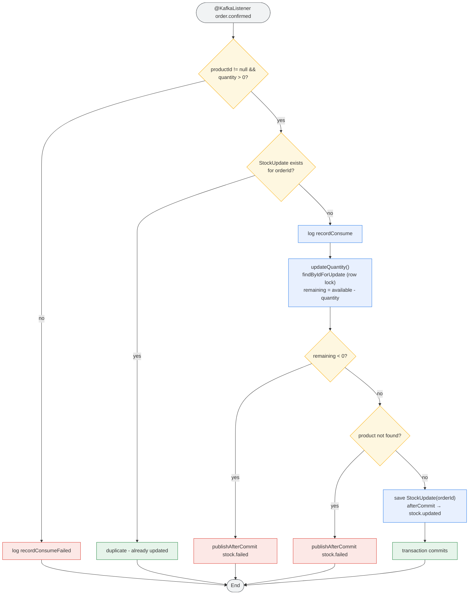
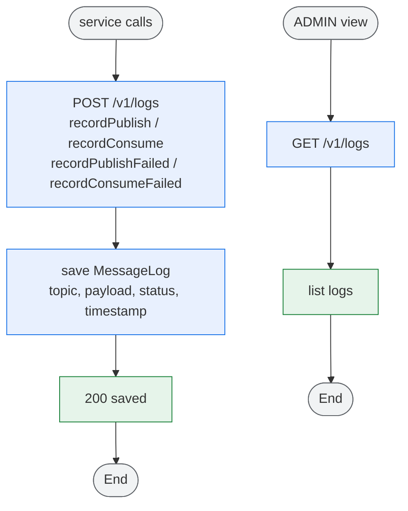

# Microservice System Architecture & Activity Flows

> High-level architecture of the whole system plus the key activity flows.
> Ports: **auth 8080**, **user 8081**, **product 8082**, **order 8083**, **log 8084**,
> **Kafka 9092**, **RabbitMQ 5672**, **PostgreSQL 5432**.
> Colors: **blue** = action, **amber** = decision, **red** = error/terminal, **green** = success,
> **grey** = start/end, **purple** = service.

## 1. System Architecture

## 2. JWT Authentication Activity (all services)

## 3. Async Order Lifecycle Activity (Kafka)

## 4. Product Stock Update Activity (product-service consumer)

## 5. Log-Service Activity

