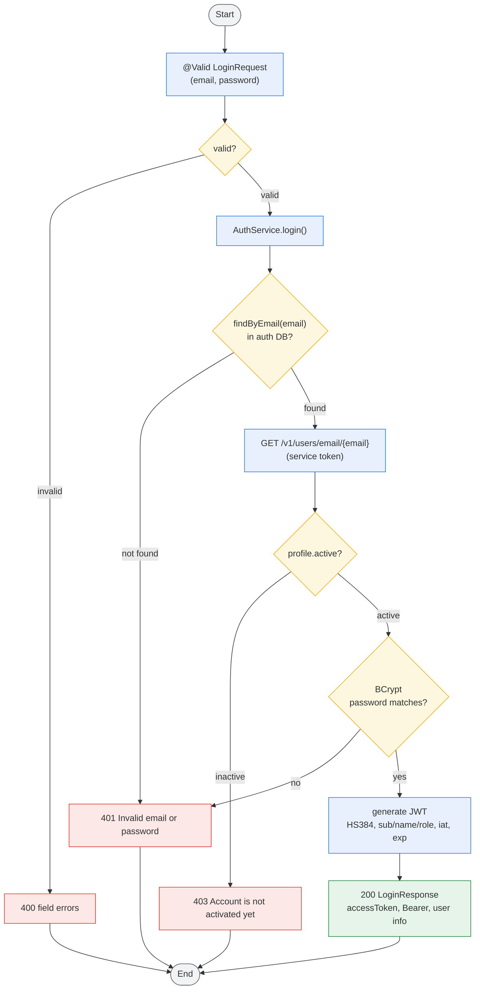
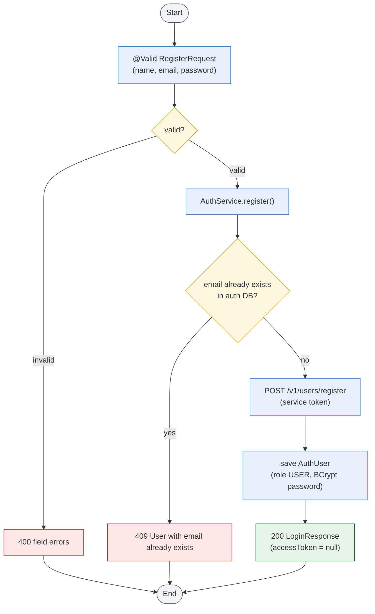
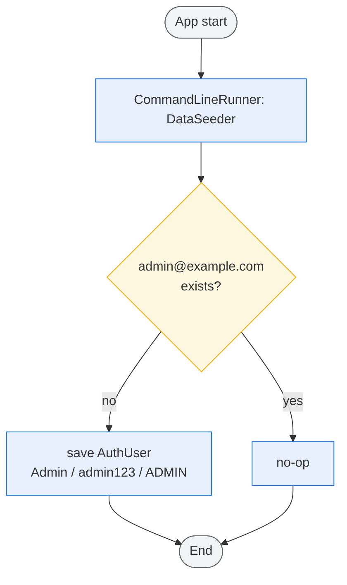
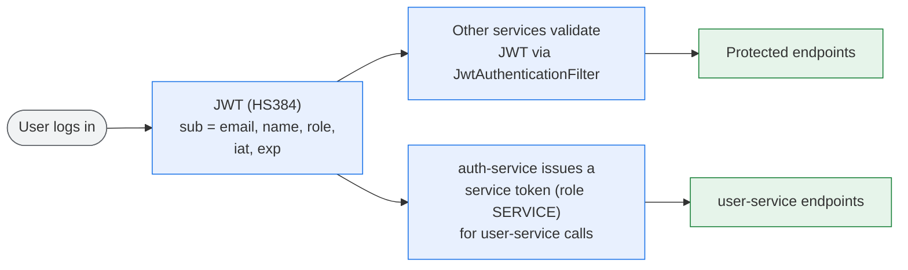

# Auth Service Activity Flow

> Activity diagrams for the auth-service. Colors mark the node roles: **blue** = action,
> **amber** = decision, **red** = error/terminal response, **green** = success response,
> **grey** = start/end.

## Login Activity (`POST /auth/login`)

## Register Activity (`POST /auth/register`)

## Startup Activity (DataSeeder)

## JWT & Inter-Service Access

