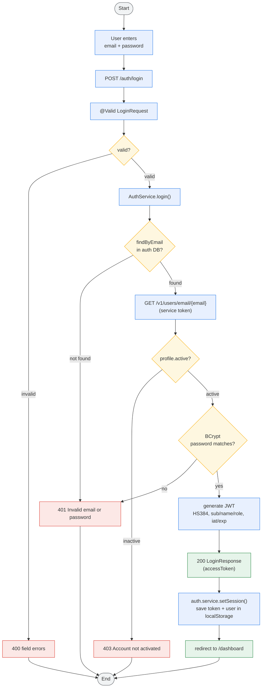
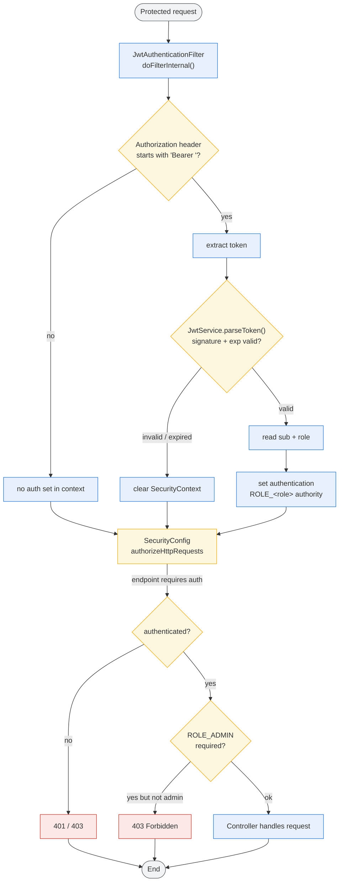
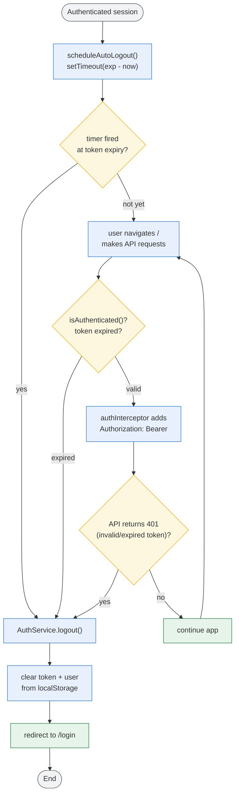

# Authentication Activity Flow

> End-to-end authentication flow across the microservices: how a user logs in,
> how the JWT is validated by downstream services, and how the session ends on expiry.
> Colors: **blue** = action, **amber** = decision, **red** = error/terminal, **green** = success, **grey** = start/end.

## 1. Login Activity (Client + Auth Service)

## 2. Token Validation Activity (Downstream Services)

Each service (user, product, order, log) runs the same filter. Shown for order-service.

## 3. Session Expiry / Auto-Logout Activity (Frontend)

