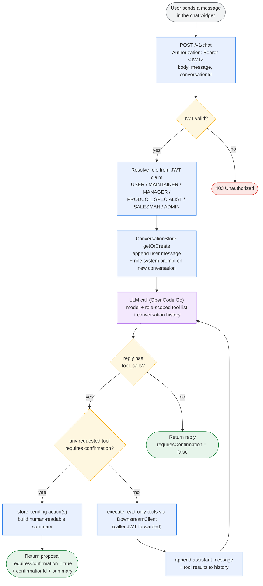
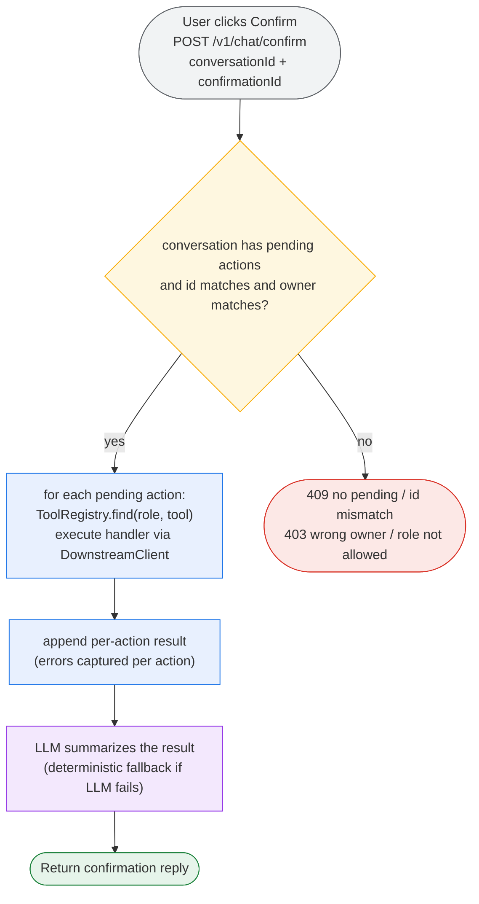
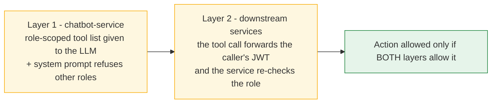
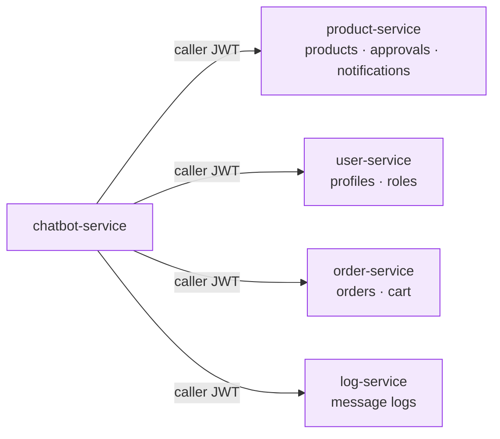

# Chatbot Activity Flow

> Role-based AI assistant for the microservice system.
> The chatbot can only perform actions allowed by the caller's role, and it can only
> act by calling the real services **with the caller's JWT** — so the backend security
> rules are the final authority.
>
> Service: **chatbot-service** (port 8085, Consul-registered).
> LLM: **OpenCode Go** (`https://opencode.ai/zen/go/v1`, OpenAI-compatible, tool calling).
> Endpoints: `POST /v1/chat`, `POST /v1/chat/confirm`, `POST /v1/chat/cancel`.
> Colors: **blue** = action, **amber** = decision, **green** = success, **red** = error,
> **grey** = start/end, **purple** = service.

## 1. Main request flow (`POST /v1/chat`)

## 2. Confirmation flow (`POST /v1/chat/confirm`)

Important actions are **never executed on the first request**. The model proposes them,
the service stores them as pending actions and returns a `confirmationId`; they execute
only after the user confirms. `/v1/chat/cancel` discards the pending actions.

## 3. Role enforcement (two layers)

## 4. Downstream calls

Every tool action is an HTTP call by chatbot-service to another service, forwarding the
caller's `Authorization` header.

## 5. Tools per role

| Role | Tools | Confirmation required |
|------|-------|-----------------------|
| General User | `list_products`, `search_products`, `get_product`, `create_order`, `list_my_orders`, `get_order`, `cancel_order`, `add_to_cart`, `view_cart`, `update_cart_quantity`, `remove_from_cart`, `clear_cart`, `checkout_cart` | `create_order`, `cancel_order`, `checkout_cart` |
| Maintainer | product read/`create_product`/`resubmit_product`, `list_orders`, `confirm_order`, `list_notifications` | `create_product`, `resubmit_product`, `confirm_order` |
| Manager / Product Specialist / Salesman | product read, `list_pending_products`, `approve_product`, `reject_product`, `list_notifications` | `approve_product`, `reject_product` |
| Admin | product read/create, `list_pending_products`, `approve_product`, `reject_product`, product updates (`update_product_name`, `update_product_price`, `add_stock`), `list_users`, `change_user_role`, `list_logs`, `list_orders`, `confirm_order` | `create_product`, `approve_product`, `reject_product`, `update_product_name`, `update_product_price`, `add_stock`, `change_user_role`, `confirm_order` |

If a role asks for an action outside its tool list, the chatbot refuses and explains that
the role does not have permission.
