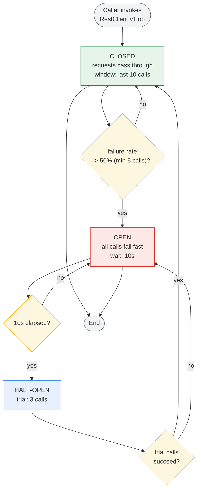
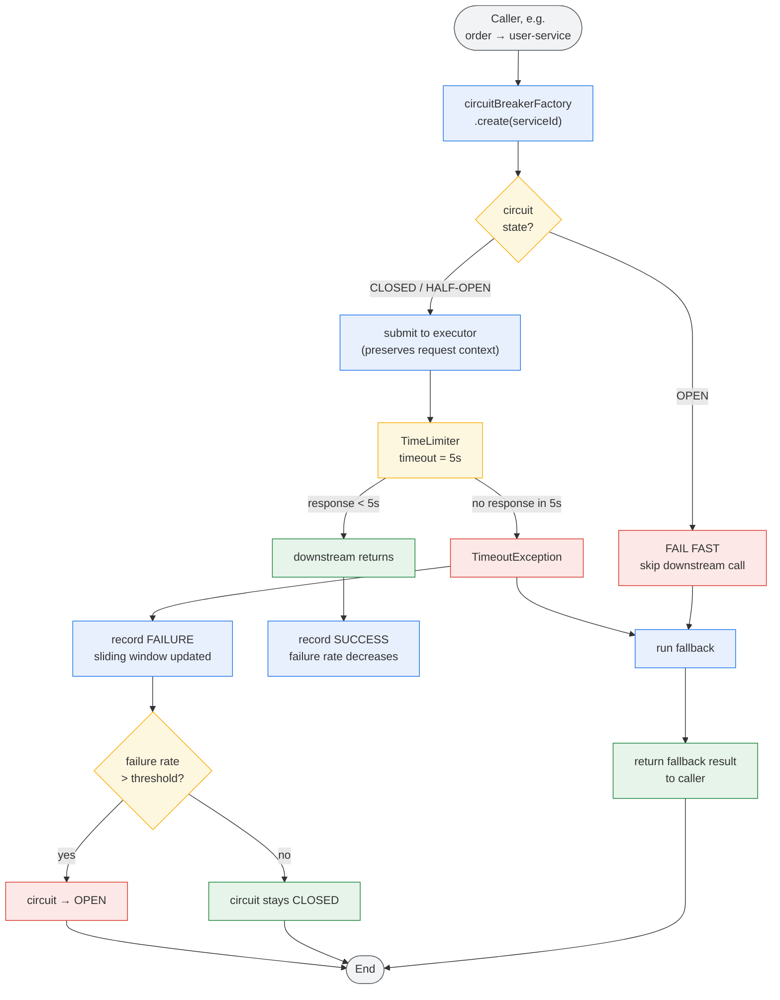
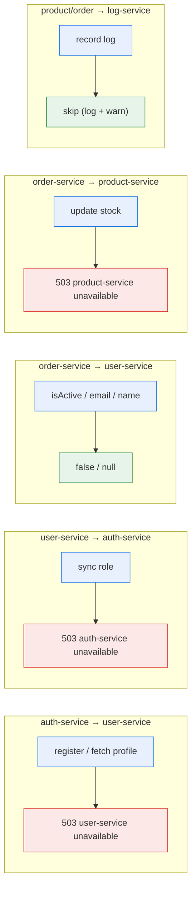

# Circuit Breaker Activity Flow

> Resilience4j circuit breaker + 5s time limiter applied to every **synchronous** RestClient call
> (the v1 REST ops). If a downstream service hangs, the call falls back after **5 seconds**; after
> repeated failures the circuit **opens**, short-circuiting further calls to the fallback.
> Colors: **blue** = action, **amber** = decision, **red** = error/terminal, **green** = success,
> **grey** = start/end, **purple** = circuit breaker.

## 1. Circuit Breaker Lifecycle (Closed → Open → Half-Open)

## 2. Per-Request Activity (5s Timeout + Fallback)

## 3. Fallback Map (per service)

