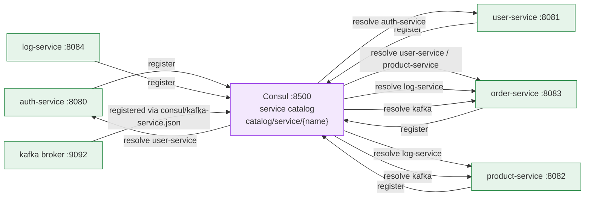
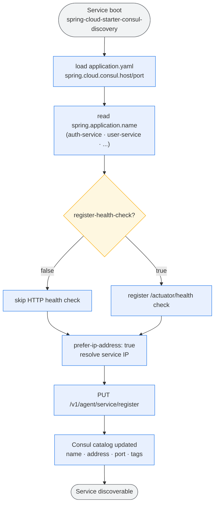
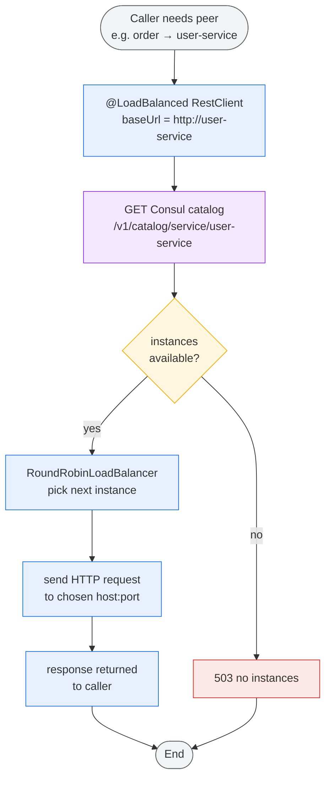
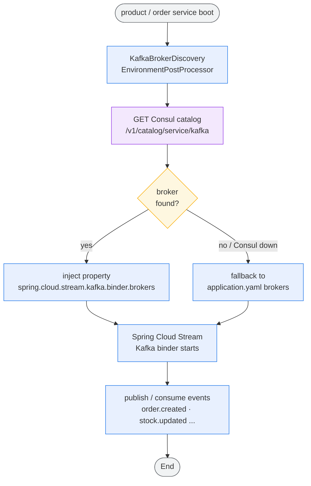
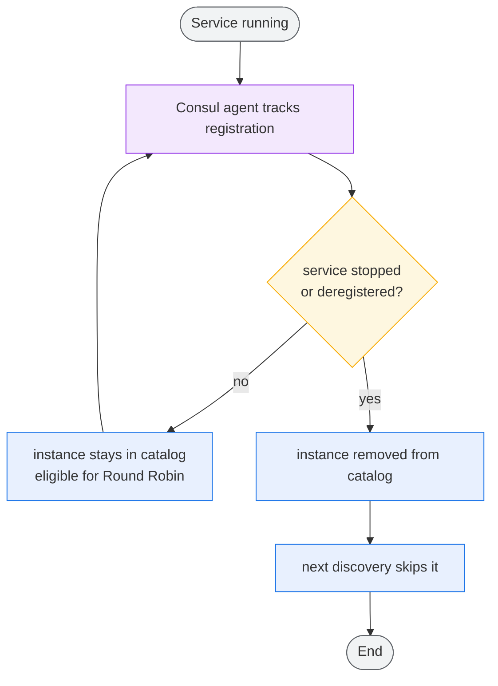

# Consul Service Registry Activity Flow

> How **Consul** acts as the service registry/discovery layer for this system.
> All Spring Boot services self-register on startup; service-to-service calls resolve instances
> from Consul. **Synchronous** calls use the `@LoadBalanced` REST client with **Round Robin**;
> **asynchronous** calls use **Kafka**, whose broker is also discovered from Consul.
> Colors: **blue** = action, **amber** = decision, **red** = error/terminal, **green** = success,
> **grey** = start/end, **purple** = registry/Consul.

## 1. Registry Overview

## 2. Service Registration (on startup)

## 3. Synchronous Discovery (REST client + Round Robin)

> Run multiple instances of a service (different ports) and Consul registers each one;
> the Round Robin load balancer alternates requests across them.

## 4. Asynchronous Broker Discovery (Kafka)

## 5. Registry State / Health

