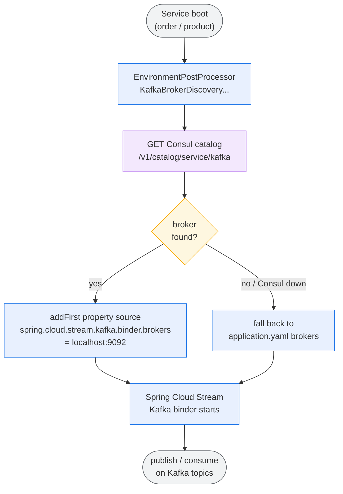
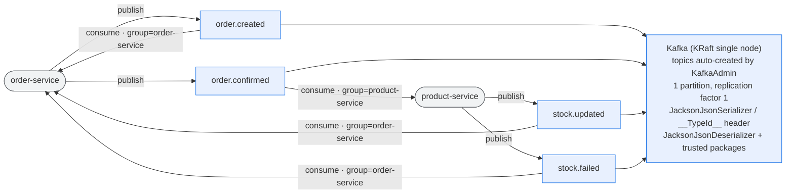
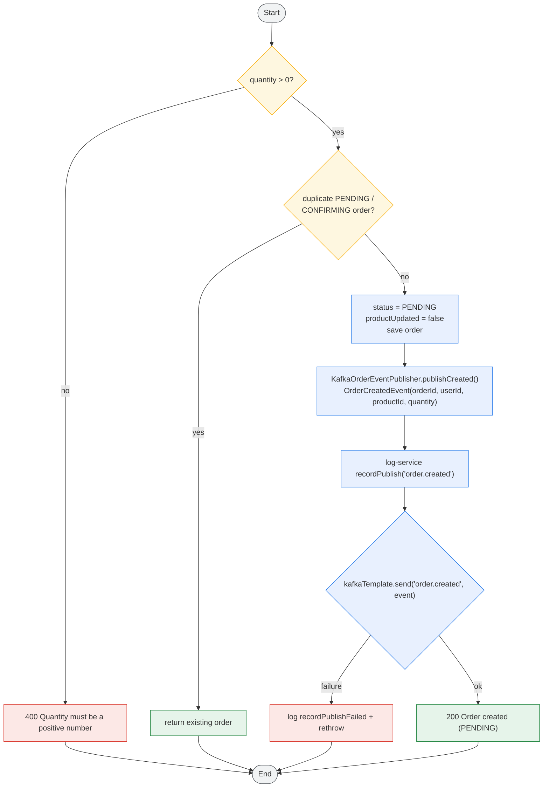
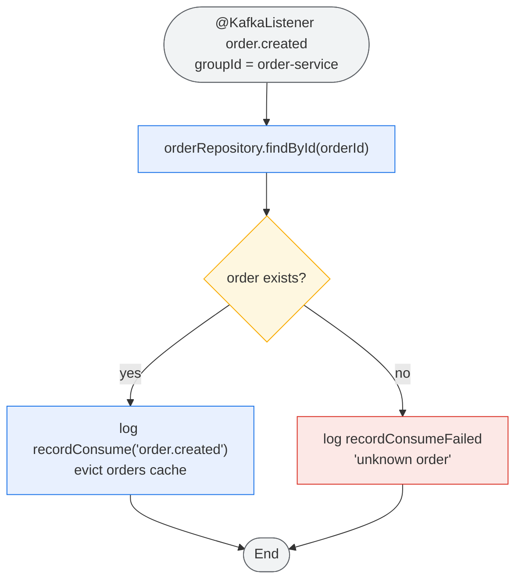
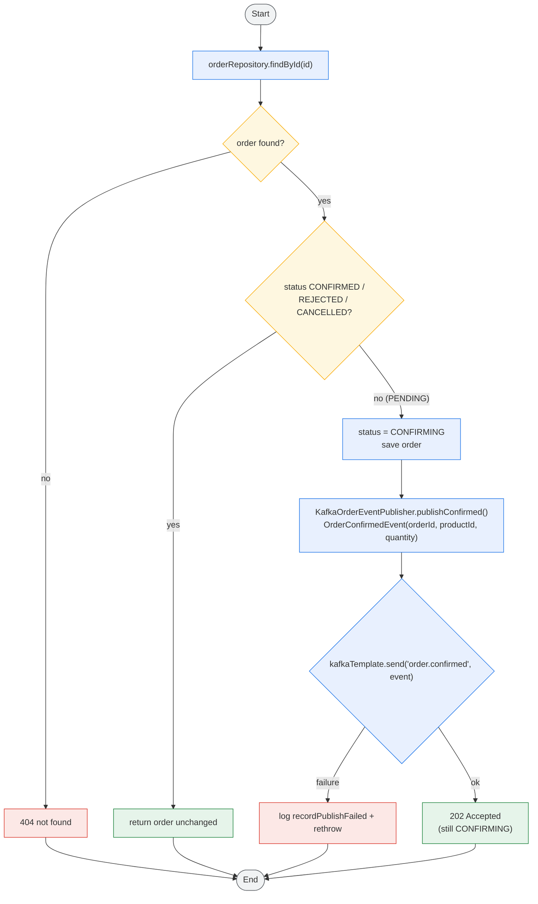
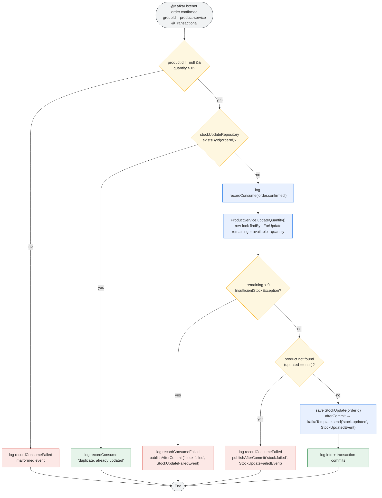
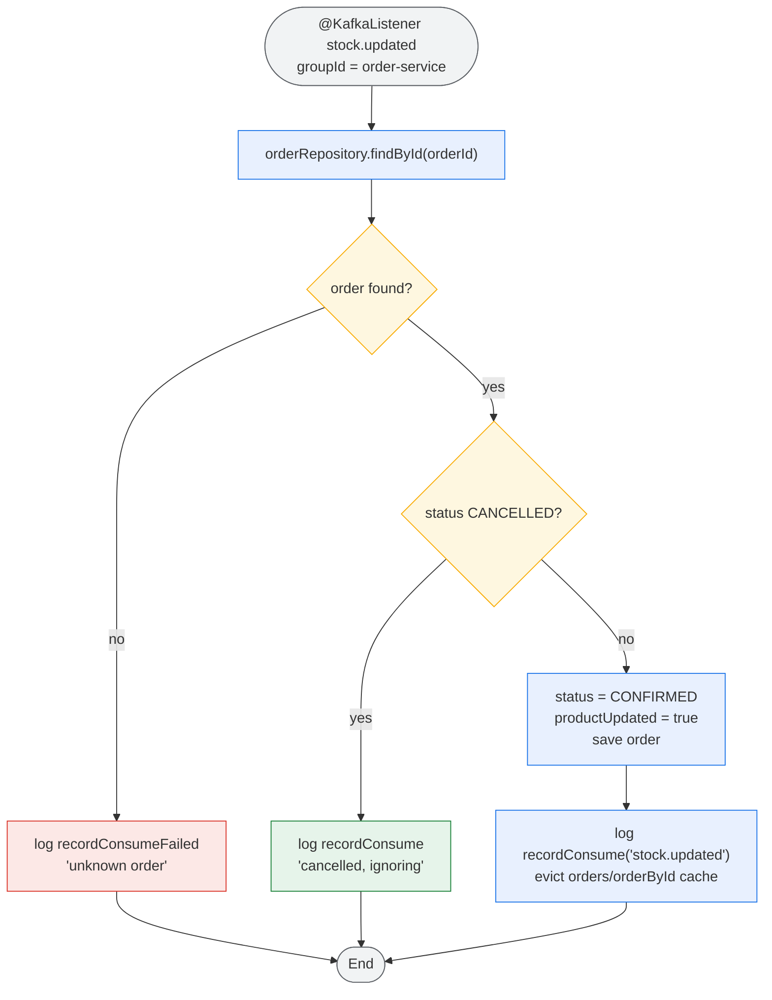
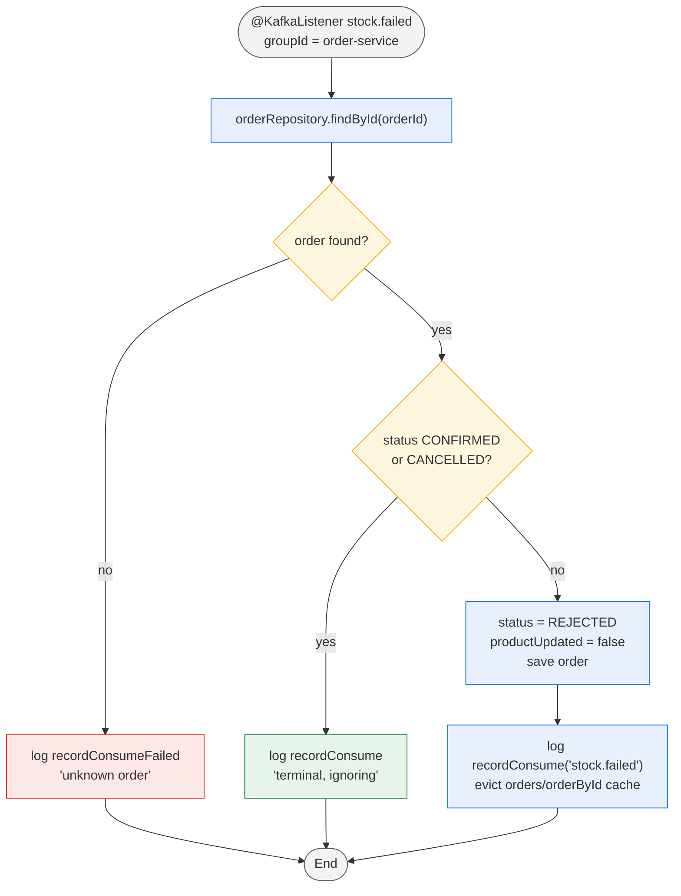
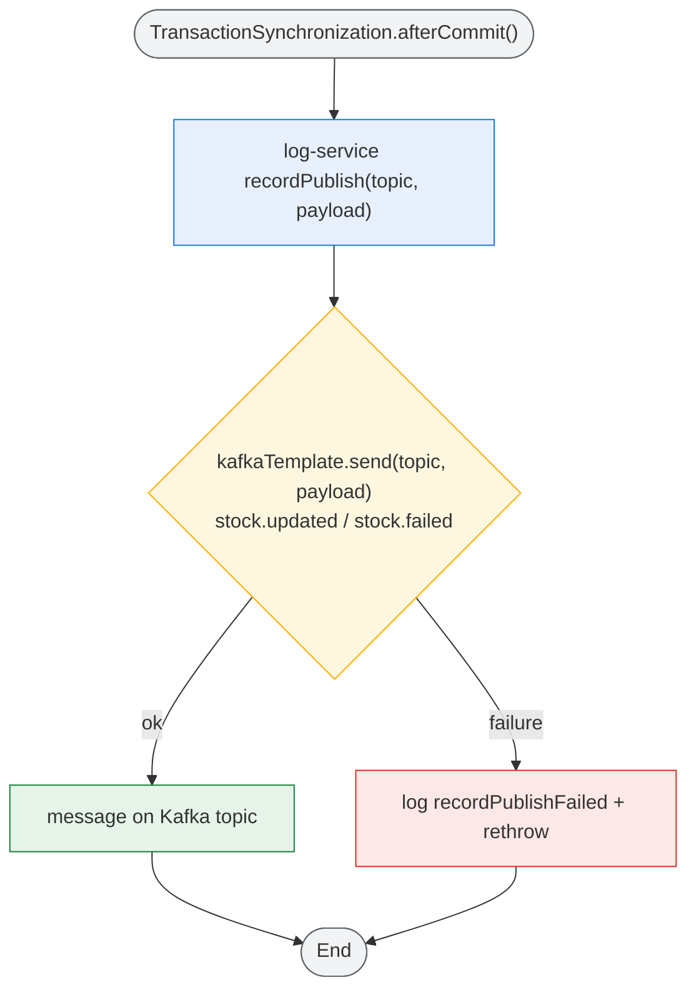

# Kafka Activity Flow

> Activity diagrams for the asynchronous order flow via Kafka. Colors mark node roles:
> **blue** = action, **amber** = decision, **red** = error/terminal response, **green** = success,
> **grey** = start/end. Topics are created via `KafkaConfig` `NewTopic` beans on startup.
> Communication split: **synchronous** service calls use the REST client (Consul + Round Robin),
> **asynchronous** calls use **Kafka**, whose broker is discovered from **Consul** at startup.

## 0. Kafka Broker Discovery via Consul (Async Path)

## 1. Kafka Topology (Topics & Consumer Groups)

## 2. Order Created Activity (`POST /v2/orders`)

## 3. Order Created Consumer Activity (order-service)

## 4. Order Confirm Activity (`POST /v2/orders/{id}/confirm`)

## 5. Order Confirmed Consumer Activity (product-service)

## 6. Stock Updated Consumer Activity (order-service)

## 7. Stock Update Failed Consumer Activity (order-service)

## 8. Publish After Commit Activity (product-service)

