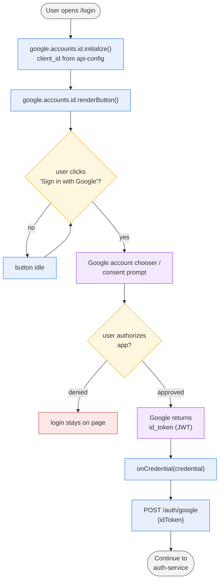
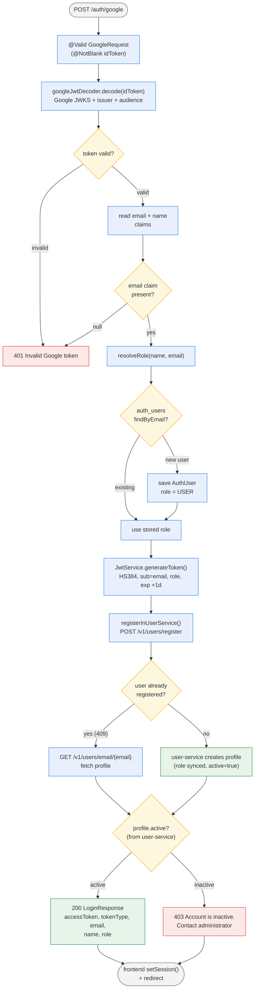
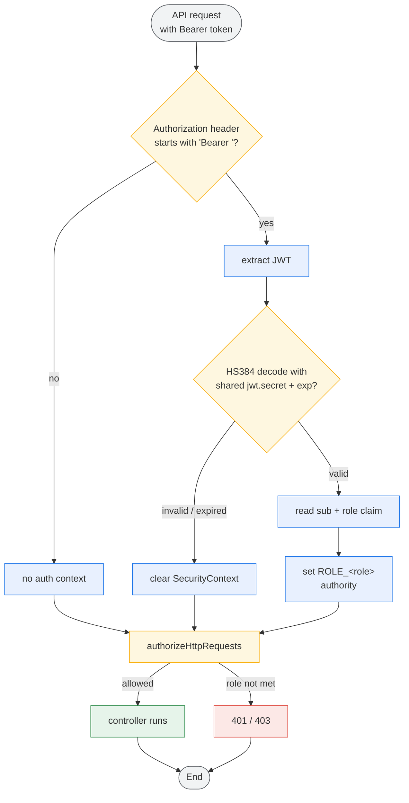

# OAuth2 Activity Flow

> OAuth2 (Google) sign-in flow for this system: how the browser obtains a Google
> id_token, how auth-service verifies it and issues the app's HS384 JWT, and how the
> role is resolved / synced to user-service.
> Colors: **blue** = action, **amber** = decision, **red** = error/terminal, **green** = success, **grey** = start/end, **purple** = external (Google).

## 1. Google Sign-In (Frontend)

## 2. Token Verification + JWT Issuance (Auth Service)

## 3. Downstream Validation (All Services)

