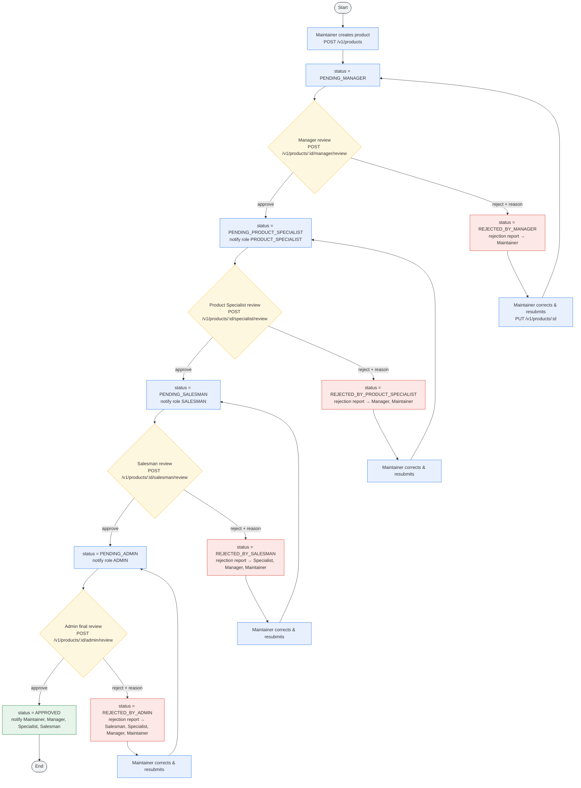

# Product Approval Activity Flow

> End-to-end review and rejection flow for products in **product-service**.
> A product must pass every stage in order:
> **Maintainer → Manager → Product Specialist → Salesman → Admin**.
> Every rejection sends a rejection report (reason) to the earlier reviewers, and the
> Maintainer corrects the product and resubmits it to the stage that rejected it.
>
> Statuses: `PENDING_MANAGER`, `PENDING_PRODUCT_SPECIALIST`, `PENDING_SALESMAN`,
> `PENDING_ADMIN`, `APPROVED`, `REJECTED_BY_MANAGER`, `REJECTED_BY_PRODUCT_SPECIALIST`,
> `REJECTED_BY_SALESMAN`, `REJECTED_BY_ADMIN`.
>
> Colors: **blue** = action, **amber** = decision, **red** = rejection, **green** = success,
> **grey** = start/end.

## 1. Activity Flow

## 2. Stage Responsibilities

| # | Stage | Role | Action on approve | Action on reject |
|---|-------|------|-------------------|------------------|
| 1 | Create | Maintainer | Product enters `PENDING_MANAGER` | — |
| 2 | Review | Manager | → `PENDING_PRODUCT_SPECIALIST` | → `REJECTED_BY_MANAGER`, report to Maintainer |
| 3 | Review | Product Specialist | → `PENDING_SALESMAN` | → `REJECTED_BY_PRODUCT_SPECIALIST`, report to Manager, Maintainer |
| 4 | Review | Salesman | → `PENDING_ADMIN` | → `REJECTED_BY_SALESMAN`, report to Specialist, Manager, Maintainer |
| 5 | Final review | Admin | → `APPROVED` (final) | → `REJECTED_BY_ADMIN`, report to Salesman, Specialist, Manager, Maintainer |

## 3. Rejection Report Matrix

| Rejected by | Rejection status | Report recipients |
|-------------|------------------|-------------------|
| Manager | `REJECTED_BY_MANAGER` | Maintainer |
| Product Specialist | `REJECTED_BY_PRODUCT_SPECIALIST` | Manager, Maintainer |
| Salesman | `REJECTED_BY_SALESMAN` | Product Specialist, Manager, Maintainer |
| Admin | `REJECTED_BY_ADMIN` | Salesman, Product Specialist, Manager, Maintainer |

## 4. Resubmission Rule

After any rejection the Maintainer edits the product and calls `PUT /v1/products/{id}`.
The product returns to the **same stage that rejected it**:

| Rejection status | Resubmits to |
|------------------|--------------|
| `REJECTED_BY_MANAGER` | `PENDING_MANAGER` |
| `REJECTED_BY_PRODUCT_SPECIALIST` | `PENDING_PRODUCT_SPECIALIST` |
| `REJECTED_BY_SALESMAN` | `PENDING_SALESMAN` |
| `REJECTED_BY_ADMIN` | `PENDING_ADMIN` |

Only the Maintainer who created the product may resubmit it, and only rejected
products can be resubmitted.

## 5. Endpoints

| Endpoint | Method | Role |
|----------|--------|------|
| `/v1/products` | POST | Maintainer |
| `/v1/products/{id}` | PUT | Maintainer (resubmit) |
| `/v1/products/{id}/manager/review` | POST | Manager |
| `/v1/products/{id}/specialist/review` | POST | Product Specialist |
| `/v1/products/{id}/salesman/review` | POST | Salesman |
| `/v1/products/{id}/admin/review` | POST | Admin |
