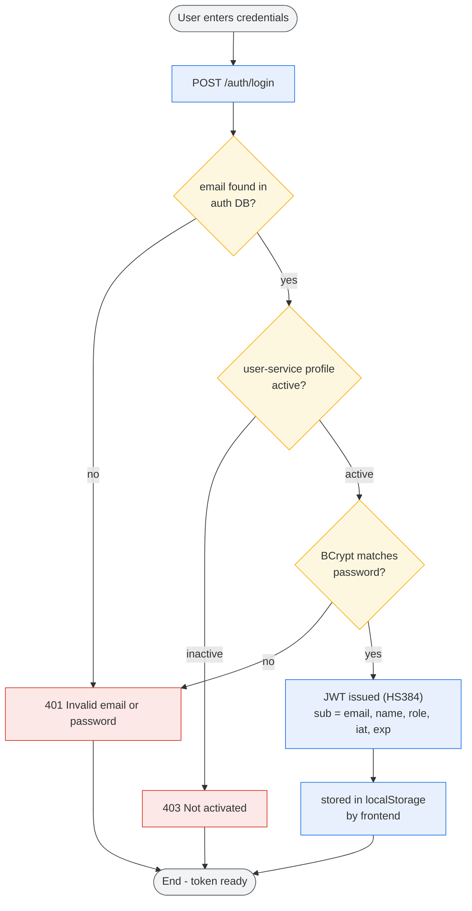
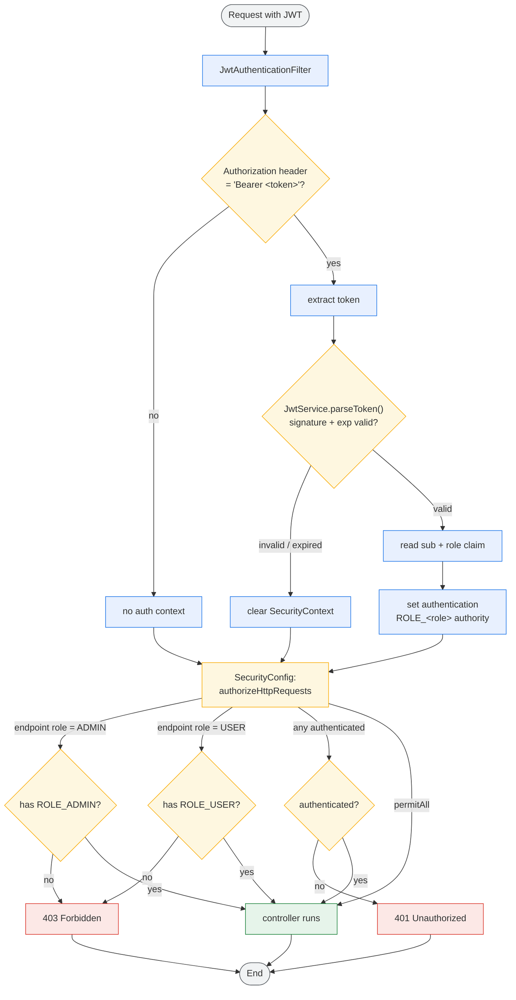
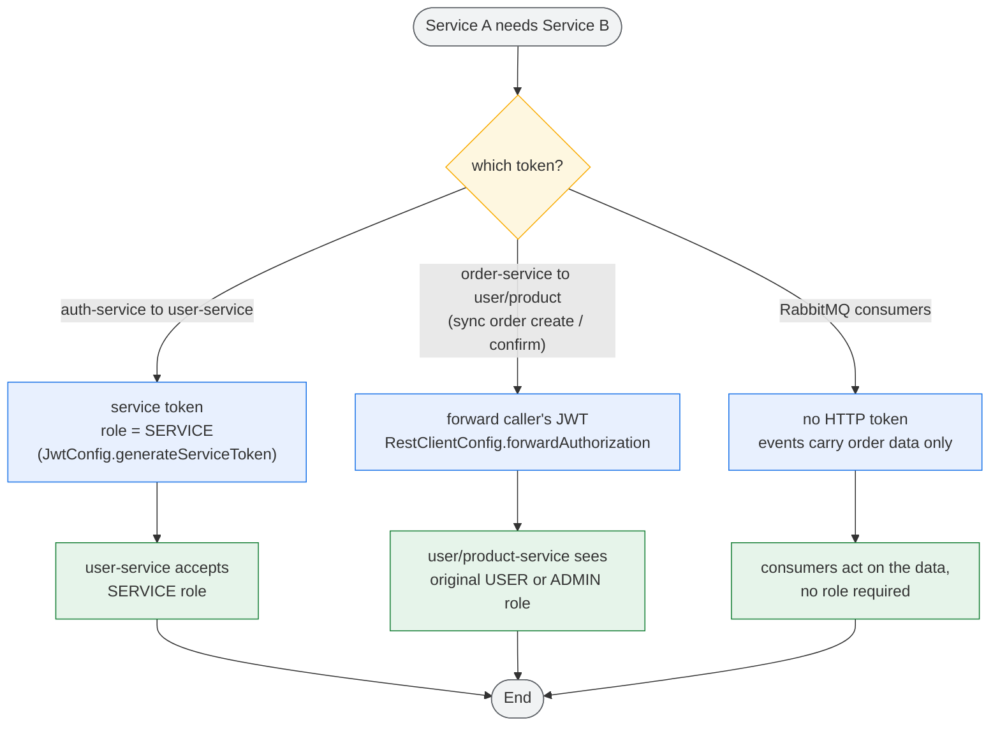

# How All Services Authenticate

> How authentication works across every microservice: a single login at the auth-service
> issues one JWT, which every other service validates on each request and then enforces
> role-based access (USER / ADMIN / SERVICE).
> Colors: **blue** = action, **amber** = decision, **red** = error/deny, **green** = success, **grey** = start/end.

## 1. Obtaining the JWT (auth-service)

## 2. Authenticating a Request in Any Service

This runs in **every** service (user, product, order, log) on each protected call.

## 3. Role Enforcement per Service

```mermaid
flowchart TD
    classDef svc fill:#f3e8fd,stroke:#9334e6,stroke-width:1px;
    classDef ad fill:#fce8e6,stroke:#d93025,stroke-width:1px;
    classDef us fill:#e6f4ea,stroke:#188038,stroke-width:1px;
    classDef both fill:#fef7e0,stroke:#f9ab00,stroke-width:1px;
    classDef term fill:#f1f3f4,stroke:#5f6368,stroke-width:1px;

    JWT(["One JWT from auth-service"]):::term --> USER["user-service"]:::svc
    JWT --> PROD["product-service"]:::svc
    JWT --> ORDER["order-service"]:::svc
    JWT --> LOG["log-service"]:::svc

    USER --> U1["POST /v1/users<br/>GET /v1/users<br/>PATCH /v1/users/{id}/active<br/>ADMIN only"]:::ad
    USER --> U2["GET /v1/users/{id}<br/>GET /v1/users/email/{email}<br/>any authenticated"]:::both
    USER --> U3["POST /v1/users/register<br/>SERVICE / ADMIN only"]:::ad

    PROD --> P1["POST /v1/products<br/>PUT /v1/products/{id}/quantity<br/>ADMIN only"]:::ad
    PROD --> P2["GET /v1/products(/{id})<br/>any authenticated"]:::both

    ORDER --> O1["GET /v1/orders/user/{userId}<br/>POST /v1/orders/{id}/cancel<br/>USER only"]:::us
    ORDER --> O2["GET /v1/orders<br/>POST /v1|v2/orders/{id}/confirm<br/>ADMIN only"]:::ad
    ORDER --> O3["POST /v1/orders<br/>POST /v2/orders<br/>USER or ADMIN"]:::both

    LOG --> L1["GET /v1/logs<br/>ADMIN only"]:::ad
    LOG --> L2["POST /v1/logs<br/>permitAll (services write)"]:::both
```

## 4. Service-to-Service Authentication

